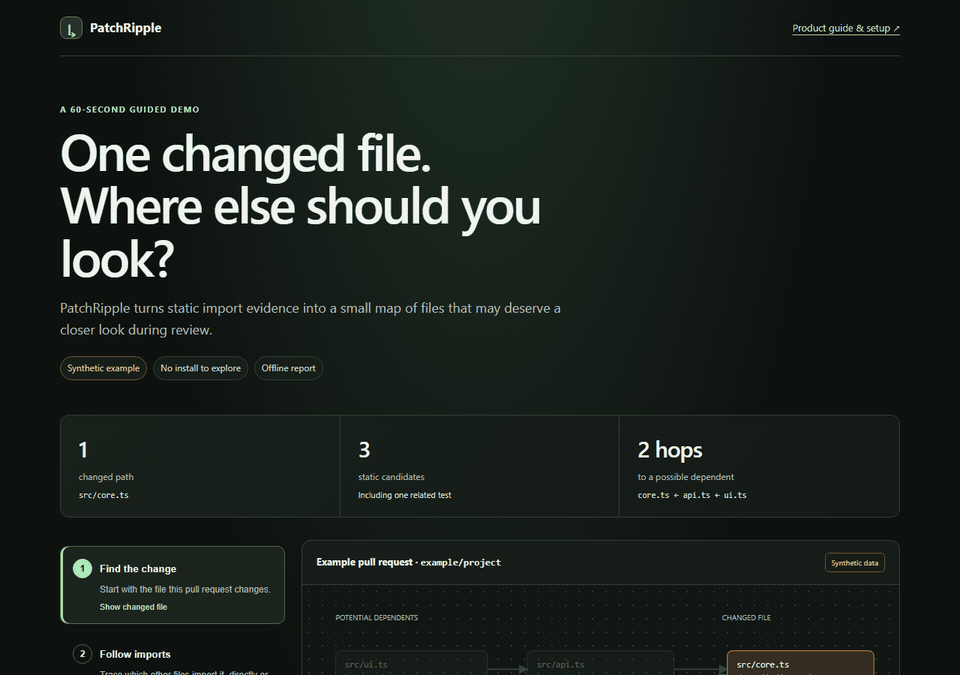

# PatchRipple

**Static impact maps for pull requests.**

PatchRipple reads exact Git revisions and maps changed files to potential import dependents, related-test evidence, and base-revision CODEOWNERS. It creates a self-contained report you can inspect offline.

> Static candidates are possibilities—not runtime effects, test coverage, or proof that a change is safe. Review the evidence and warnings alongside the diff.

[Open the demo walkthrough](docs/demo/walkthrough.html) · [See the security model](docs/SECURITY.md) · [Review the graph schema](docs/graph-schema-v1.md)

## What it does

- Compares a pull request from the merge base of its base and head revisions, or compares two exact revisions directly.
- Finds static JavaScript, TypeScript, and Python import relationships in both revisions.
- Adds related-test hints and uses CODEOWNERS from the base revision.
- Produces an offline HTML report, JSON graph, SVG map, and metadata file.
- Shows uncertainty, warnings, and analysis limits instead of presenting guesses as proof.

The CLI and Action read repository data and create the report in the environment where you run them. They do not execute code, configuration, or hooks from the repository being analyzed, and they do not install its dependencies.

## Try the demo

The animated preview above and the [clickable walkthrough](docs/demo/walkthrough.html) use fictional repository data and commit SHAs. Open the walkthrough or [offline report](docs/demo/index.html) in a browser; neither requires installation.

## Quick start

Use Node.js 24 or newer, Git, a trusted PatchRipple checkout, and exact base and head commits available in the target repository. The bundled CLI is `dist/cli.cjs`; no PatchRipple dependency installation is needed inside the target repository.

First check that the revisions and output path are usable:

~~~sh
node /path/to/PatchRipple/dist/cli.cjs doctor --repo /path/to/target --base BASE_SHA --head HEAD_SHA --out /path/to/new-report
~~~

Then generate the report in that same new path:

~~~sh
node /path/to/PatchRipple/dist/cli.cjs analyze --repo /path/to/target --base BASE_SHA --head HEAD_SHA --repository https://github.com/OWNER/REPOSITORY --out /path/to/new-report
~~~

`doctor` is read-only and creates no files, so its output path can be reused by `analyze`. The output directory must be new and outside the target repository; existing paths are refused. PatchRipple does not fetch missing Git history. If a revision is unavailable, fetch it yourself and rerun the diagnostic.

PR mode is the default: it compares `merge-base(base, head)` to `head`. Use `--mode direct` to compare exactly the two supplied revisions.

## Read the report

The output bundle contains:

| File | Contents |
| --- | --- |
| `index.html` | Interactive, self-contained offline report |
| `graph.json` | Validated graph data |
| `graph.svg` | Static map |
| `metadata.json` | Tool version, generation time, and analysis limits |

The HTML report loads no external assets or data. Its source and comparison links open GitHub only when you choose them. The diagram shows a focused neighborhood; the full candidate list and analysis warnings remain available in the report.

An exit code of `0` means a valid report was produced, possibly with visible uncertainty. It does not mean the analysis is complete or the change is safe.

## Supported analysis and limits

| Area | Evidence PatchRipple can report |
| --- | --- |
| JavaScript and TypeScript | Literal imports and re-exports, type-only imports, literal dynamic imports, and `require`; relative paths, supported nested TypeScript path aliases, and declared workspace package entries |
| Python | Static `import` and `from` relationships, relative imports, package initializers, and configured source roots |
| Tests | Likely related test files based on import relationships and adjacent or naming conventions; these are heuristics, not test-coverage results |
| CODEOWNERS | Matches from base-revision precedence (.github/CODEOWNERS, root CODEOWNERS, then docs/CODEOWNERS); the last matching supported rule wins |

Dynamic import expressions, wildcard or unresolved Python imports, unresolved local paths, unsupported configuration or syntax, parser uncertainty, symlinks, submodules, and resource limits can produce warnings or omissions. Expected external package imports remain visible as exclusions; by themselves, they do not make the graph incomplete.

Supported CODEOWNERS patterns include directory patterns, `*`, `**`, and `?`, with user, team, or email owners. Unsupported patterns warn; team membership is not looked up.

A “complete” graph means complete within PatchRipple’s documented static syntax. It does not establish runtime reachability, test coverage, or safety. See the [graph schema](docs/graph-schema-v1.md) for warning categories and completeness semantics.

Per-revision input limits:

| Limit | Maximum |
| --- | ---: |
| Files | 5,000 |
| Aggregate source size | 40 MiB |
| Source file size | 512 KiB |

Graph and analysis limits:

| Limit | Maximum |
| --- | ---: |
| Candidate nodes | 500 |
| Candidate edges | 2,000 |
| Reverse traversal depth | 20 |
| Git and parsing time | 60 seconds |

CLI and Action options can lower the file-count, candidate-node, traversal-depth, and analysis-time ceilings; supplied values cannot raise a built-in maximum. The report diagram displays up to 18 nodes at a time; filters and hop controls help inspect larger candidate sets.

## GitHub Action

The repository includes an Action manifest and a [consumer workflow template](docs/consumer-workflow.yml.example). The template uses `pull_request` with read-only `contents` permission and verifies that the exact base and head Git objects are available.

Before using the template, replace `PATCHRIPPLE_COMMIT` with the full commit SHA you have reviewed. Keep the exact-revision checks and read-only permissions. Do not use `pull_request_target` or expose secrets to analysis of pull-request data.

The generated bundle can include repository paths, owners, and dependency relationships. Review it before uploading or sharing it. See the [security notes](docs/SECURITY.md) for the full trust boundary.

## Develop PatchRipple

Use Node.js 24 or newer and Git in a trusted PatchRipple checkout:

~~~sh
npm ci --ignore-scripts
npm run verify
npm run demo
npm run test:package
~~~

`npm run verify` runs linting, type checking, tests, and the build. Browser checks are also available:

~~~sh
npm run test:browser:fixtures
npm run test:browser
~~~

Browser tests require the supported Playwright browser to be installed. These commands build and test PatchRipple itself; they do not install or execute dependencies from a target repository.

## License

PatchRipple is MIT licensed. Third-party component notices and license details are included in [`dist/THIRD_PARTY_NOTICES.txt`](dist/THIRD_PARTY_NOTICES.txt).
